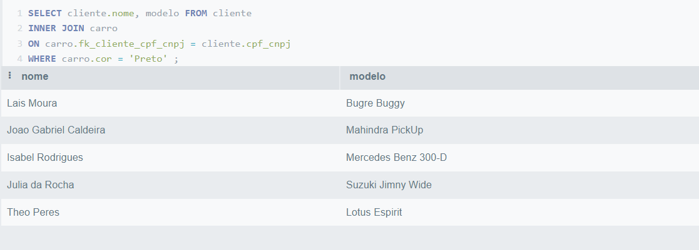
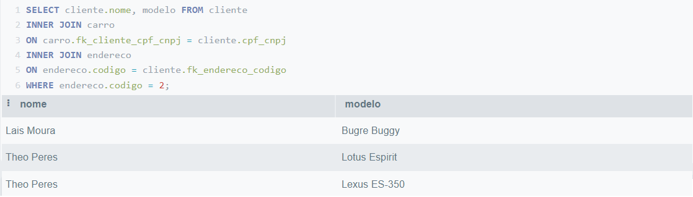
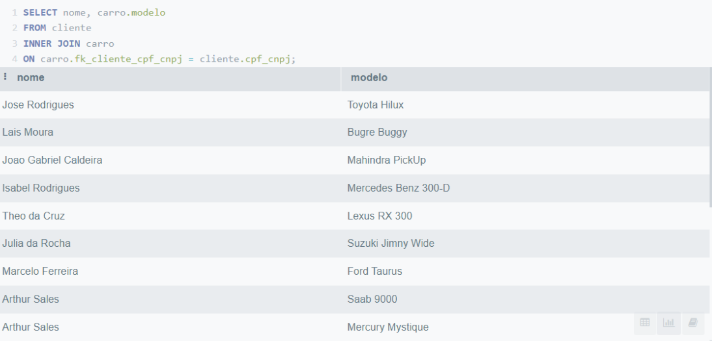

# TRABALHO 01:  Carro Fácil
Trabalho desenvolvido durante a disciplina de BD1

# Sumário

### 1. COMPONENTES 
Integrantes do grupo 
primeiro_componente_do_grupo:caiobuteri10@gmail.com

segundo_componente_do_grupo:joaovitordellpa@gmail.com
... 

### 2.INTRODUÇÃO E MOTIVAÇÃO 
Este documento contém a especificação do projeto do banco de dados Carro Facíl 
 e motivação da escolha realizada.  

> Com o objetivo de facilitar a relação entre vendedores e compradores de automóveis novos, seminovos e usados, decidimos focar no desenvolvimento de um sistema de fácil utilização onde clientes interessados em comprar um novo veículo possam encontrar seus vendedores. O sistema Carro Fácil tem como objetivo gerenciar essa relação de venda, para isso o sistema deve ser capaz de armazenar informações sobre os veículos que serão vendidos, os compradores, vendedores e as empresas transportadoras parceiras. Além disso, o sistema deve ser capaz de gerar relatórios com essas informações como por exemplo: “Quais modelos foram mais vendidos?”, “Qual o valor médio de cada venda?”, “Quais os lugares onde mais carros foram comprados?”, etc.
 

### 3.MINI-MUNDO 

Desejamos o desenvolvimento de um sistema de compra e venda de veículos, onde os usuários do sistema devem ser capazes de listar seus veículos para venda e comprar veículos listados por outros usuários. Dos clientes é necessário saber: nome, endereço, cpf, idade e veículos carros ele possui. Dos veículos é necessário saber: número do chassi, modelo, km rodados, cor da pintura e preço. Carros só podem ser listados para venda caso não tenham nenhum problema técnicos. Além disso, o sistema deve ser capaz de entrar em contato com empresas parceiras que realizam o transporte dos carros, as empresas devem ser cadastradas no sistema e delas deseja-se saber o nome, local de atuação e preço. Além disso, o sistema deve ser de facíl utilização pelos usuários, rápido e os clientes compradores devem sempre receber as melhores ofertas ao buscar por um modelo específico para comprar.

### 4.PROTOTIPAÇÃO, PERGUNTAS A SEREM RESPONDIDAS E TABELA DE DADOS 
#### 4.1 RASCUNHOS BÁSICOS DA INTERFACE (MOCKUPS) 

Telas criadas: https://www.quant-ux.com/#/test.html?h=a2aa10anD2ug8zimyXpWlBV3ybNneHkECzFiUDS3ZZ38ZN4oit3TIeIadyoi&ln=en
(Todas as telas tambem se encontram na pasta do git hub *TELAS 4.1*, dentro da pasta images )

#### 4.2 QUAIS PERGUNTAS PODEM SER RESPONDIDAS COM O SISTEMA PROPOSTO?
    a) Com os dados salvos em nosso banco de dados podemos responder perguntas como: Quais foram os veículos mais vendidos de uma determinada região, qual a faixa de kilometragem mais bucada pelos compradores, qual o ticket médio dos clientes, quais as datas em que mais ocorream vendas, quais cores de carro mais são vendidas, etc.
    
    
    b) Crie uma lista com os 5 principais relatórios que poderão ser obtidos por meio do sistema proposto!

O sistema poderá fornecer relatórios envolvendo dados dos clientes, carros a vendas, vendas feitas e transportadoras. Com ele será possível saber em quais meses têm mais vendas, quais clientes compram mais

- Modelos de veículo mais vendidos
- Mês com mais vendas
- Ticket médio dos clientes
- Qual estado mais vende carros
- Faixa de kilometragem mais procurada
 
#### 4.3 TABELA DE DADOS DO SISTEMA:
    a) Esta tabela deve conter todos os atributos do sistema e um mínimo de 10 linhas/registros de dados.
    b) Esta tabela tem a intenção de simular um relatório com todos os dados que serão armazenados 
    

    
    
### 5.MODELO CONCEITUAL 
    A) Utilizar a Notação adequada (Preferencialmente utilizar o BR Modelo 3)
    B) O mínimo de entidades do modelo conceitual pare este trabalho será igual a 3 e o Máximo 5.
        * informe quais são as 3 principais entidades do sistema em densenvolvimento (se houverem mais de 3 entidades, pense na importância da entidade para o sistema)       
    C) Principais fluxos de informação/entidades do sistema (mínimo 3).  Dica: normalmente estes fluxos estão associados as tabelas que conterão maior quantidade de dados 
    D) Qualidade e Clareza
        Garantir que a semântica dos atributos seja clara no esquema (nomes coerentes com os dados).
        Criar o esquema de forma a garantir a redução de informação redundante, possibilidade de valores null, 
        e tuplas falsas (Aplicar os conceitos de normalização abordados).   

        
    
#### 5.1 Validação do Modelo Conceitual
    [Grupo01]: [Nomes dos que participaram na avaliação]
    [Grupo02]: [Nomes dos que participaram na avaliação]

#### 5.2 Descrição dos dados    
    PAIS: Tabela que armazena as informações relativas ao País
    NOME: campo que armazena o nome do país
    
    ESTADO: Tabela que armazena as informações relativas ao estado
    NOME: campo que armazena o nome do estado
    
    CIDADE: Tabela que armazena as informações relativas a Cidade
    NOME: campo que armazena o nome da Cidade
    
    BAIRRO: Tabela que armazena as informações relativas ao Bairro
    NOME: campo que armazena o nome do bairro
    
    RUA: Tabela que armazena as informações relativas a Rua
    NOME: campo que armazena o nome da Rua
    
    ENDERECO: Tabela que armazena as informações relativas ao endereco do cliente
    NUMERO: campo que armazena o Numero da residencia
    
    CLIENTE: Tabela que armazena as informações relativas ao cliente
    CPF: campo que armazena o CPF do cliente
    NOME: campo que armazena o nome do cliente
    DATA_NASCIMENTO: campo que armazena a data de nascimento do cliente
    
    CARRO: Tabela que armazena as informações relativas ao carro
    NUMERO_CHASSI: campo que armazena o documento de identidade do carro
    MODELO: campo que armazena o modelo do carro
    KM_RODADOS: campo que armazena o numero de km rodados do carro
    COR: campo que armazena a cor do carro
    PRECO: campo que armazena o PREÇO do carro
    
    PEDIDO: Tabela que armazena as informações relativas ao pedido de compra/venda
    DATA: campo que armazena a data do pedido
    
    TRANSPORTADORA: Tabela que armazena as informações relativas a transportadora que vai entregar o carro
    NOME: campo que armazena o nome da transportadora
    AREA_ATUACAO: campo que armazena a area de atuacao da transportadora
    PRECO: campo que armazena o preco da entrega pela transportadora

### 6	MODELO LÓGICO 
        a) inclusão do esquema lógico do banco de dados
        b) verificação de correspondencia com o modelo conceitual 
        (não serão aceitos modelos que não estejam em conformidade)

### 7	MODELO FÍSICO 
CREATE TABLE Carro (
    codigo SERIAL PRIMARY KEY,
    numero_chassi INT,
    modelo VARCHAR(50),
    km_rodados FLOAT,
    cor VARCHAR(50),
    preco FLOAT,
    fk_Cliente_cpf_cnpj VARCHAR(50)
);

CREATE TABLE Cliente (
    codigo SERIAL PRIMARY KEY,
    cpf_cnpj VARCHAR(50) PRIMARY KEY,
    nome VARCHAR(50),
    data_nascimento DATE,
    fk_Endereco_codigo SERIAL
);

CREATE TABLE Venda (
    codigo SERIAL PRIMARY KEY,
    data DATE,
    fk_Cliente_cpf_cnpj VARCHAR(50),
    fk_Cliente_cpf_cnpj_ VARCHAR,
    fk_Transportadora_codigo SERIAL
);

CREATE TABLE Transportadora (
    codigo SERIAL PRIMARY KEY,
    nome VARCHAR(50),
    area_atuacao VARCHAR(50),
    preco FLOAT
);

CREATE TABLE Endereco (
    codigo SERIAL PRIMARY KEY,
    numero INT,
    fk_Rua_codigo SERIAL
);

CREATE TABLE Pais (
    codigo SERIAL PRIMARY KEY,
    nome VARCHAR(50)
);

CREATE TABLE Estado (
    codigo SERIAL PRIMARY KEY,
    nome VARCHAR(50),
    fk_Pais_codigo SERIAL
);

CREATE TABLE Cidade (
    codigo SERIAL PRIMARY KEY,
    nome VARCHAR(50),
    fk_Estado_codigo SERIAL
);

CREATE TABLE Bairro (
    codigo SERIAL PRIMARY KEY,
    nome VARCHAR(50),
    fk_Cidade_codigo SERIAL
);

CREATE TABLE Rua (
    nome VARCHAR(50),
    codigo SERIAL PRIMARY KEY,
    fk_Bairro_codigo SERIAL
);

CREATE TABLE Faz_parte (
    fk_Carro_codigo SERIAL,
    fk_Venda_codigo SERIAL
);
 
ALTER TABLE Carro ADD CONSTRAINT FK_Carro_2
    FOREIGN KEY (fk_Cliente_cpf_cnpj)
    REFERENCES Cliente (cpf_cnpj)
    ON DELETE CASCADE;
 
ALTER TABLE Cliente ADD CONSTRAINT FK_Cliente_2
    FOREIGN KEY (fk_Endereco_codigo)
    REFERENCES Endereco (codigo)
    ON DELETE RESTRICT;
 
ALTER TABLE Venda ADD CONSTRAINT FK_Venda_2
    FOREIGN KEY (fk_Cliente_codigo)
    REFERENCES Cliente (codigo)
    ON DELETE CASCADE;

ALTER TABLE Venda ADD CONSTRAINT FK_Venda_3
    FOREIGN KEY (fk_Transportadora_codigo)
    REFERENCES Transportadora (codigo)
    ON DELETE CASCADE;

 
ALTER TABLE Endereco ADD CONSTRAINT FK_Endereco_2
    FOREIGN KEY (fk_Rua_codigo)
    REFERENCES Rua (codigo)
    ON DELETE CASCADE;
 
ALTER TABLE Estado ADD CONSTRAINT FK_Estado_2
    FOREIGN KEY (fk_Pais_codigo)
    REFERENCES Pais (codigo)
    ON DELETE CASCADE;
 
ALTER TABLE Cidade ADD CONSTRAINT FK_Cidade_2
    FOREIGN KEY (fk_Estado_codigo)
    REFERENCES Estado (codigo)
    ON DELETE CASCADE;
 
ALTER TABLE Bairro ADD CONSTRAINT FK_Bairro_2
    FOREIGN KEY (fk_Cidade_codigo)
    REFERENCES Cidade (codigo)
    ON DELETE CASCADE;
 
ALTER TABLE Rua ADD CONSTRAINT FK_Rua_2
    FOREIGN KEY (fk_Bairro_codigo)
    REFERENCES Bairro (codigo)
    ON DELETE CASCADE;
 
ALTER TABLE Faz_parte ADD CONSTRAINT FK_Faz_parte_1
    FOREIGN KEY (fk_Carro_codigo)
    REFERENCES Carro (codigo)
    ON DELETE RESTRICT;
 
ALTER TABLE Faz_parte ADD CONSTRAINT FK_Faz_parte_2
    FOREIGN KEY (fk_Venda_codigo)
    REFERENCES Venda (codigo)
    ON DELETE SET NULL;
        
       
### 8	INSERT APLICADO NAS TABELAS DO BANCO DE DADOS 
        a) inclusão das instruções de inserção dos dados nas tabelas criadas pelo script de modelo físico
        (Drop para exclusão de tabelas + create definição de para tabelas e estruturas de dados + insert para dados a serem inseridos)
        b) Criar um novo banco de dados para testar a restauracao 
        (em caso de falha na restauração o grupo não pontuará neste quesito)
        c) formato .SQL
-- Inserir paises
INSERT into pais (codigo, nome)
VALUES (1,'Brasil'),
       (2,'Argentina'),
       (3,'Paraguai'),
       (4,'Uruguai');
-- Inserir Estados
INSERT into estado(codigo, nome, fk_pais_codigo)
VALUES (1, 'Espirito Santo', 1),
        (2, 'Sao Paulo',1),
        (3, 'Pará',1),
        (4, 'Buenos Aires',2),
        (5, 'Assunção',3),
        (6, 'Montevideu',4); 
-- Inserir cidades
INSERT into cidade(codigo, nome, fk_estado_codigo)
VALUES (1, 'Vitoria', 1),
        (2, 'Sao Paulo',2),
        (3, 'Belém',3),
        (4, 'Buenos Aires',4),
        (5, 'Assunção',5),
        (6, 'Montevideu',6); 
--Inserir bairros
INSERT into bairro(codigo, nome, fk_cidade_codigo)
VALUES (1, 'Goiabeiras', 1),
        (2, 'Mooca',2),
        (3, 'Ipiranga', 2),
        (4, 'Baia do Sol',3),
        (5, 'San Telmo',4),
        (6, 'San Pablo',5),
        (7, 'Boceo',6); 

-- Inserir ruas
INSERT into rua(codigo, nome, fk_bairro_codigo)
VALUES (1, 'Rua Silvana Rosa', 1),
        (2, 'Rua Camé',2),
        (3, 'Rua Imbuial', 3),
        (4, 'Rua Clovis',4),
        (5, 'Cocha Bamba',5),
        (6, 'Dolores Vera',6),
        (7, 'Pinzón',7); 
--Inserir endereço
INSERT into endereco(codigo, nome, fk_rua_codigo)
VALUES (1, 10, 1),
        (2, 20,2),
        (3, 30, 3),
        (4, 40 ,4),
        (5, 50 ,5),
        (6, 60 ,6),
        (7, 70,7),
        (8, 11, 1),
        (9, 21, 2),
        (10, 22, 2);

INSERT INTO cliente (cpf_cnpj, nome, data_nascimento, fk_endereco_codigo)
VALUES  (1111,'Jose Rodrigues','1980-01-19',1),
(2222,'Lais Moura','1980-12-07',2),
         (3333,'Joao Gabriel Caldeira','1982-03-11',3),
         (4444,'Isabel Rodrigues','1982-10-17',4),
         (5555,'Theo da Cruz','1983-06-11',5),
         (6666,'Julia da Rocha','1984-02-26',6),
         (7777,'Marcelo Ferreira','1986-01-06',7),
         (8888,'Arthur Sales','1988-04-07',8),
         (9999,'Breno Fogaça','1988-11-24',9),
         (1010,'Hugo Mendes','1991-05-30',1),
         (1100,'Kim Ito','1992-01-08',1),
         (1212,'Theo Peres','1995-12-25',2),
         (1313,'Caio Justa','1996-11-07',3),
         (1414,'Ingrid Motta','1997-11-12',4),
         (1515,'Gilberto Silva','2001-12-05',1),
         (1616,'Lucas Lopez','2003-11-17',1);

INSERT INTO carro (codigo, numero_chassi, modelo, km_rodados, cor, preco, fk_cliente_cpf_cnpj)
VALUES  (1, 001, 'Toyota Hilux', 14600,'Azul',220000, 1111),
		(2, 002, 'Bugre Buggy', 17125,'Preto',45000, 2222),
        (3, 003, 'Mahindra PickUp', 22950,'Preto',46000, 3333),
        (4, 004, 'Mercedes Benz 300-D', 12100,'Preto',20000, 4444),
        (5, 005, 'Lexus RX 300', 14145,'Prata',180000, 5555),
        (6, 006, 'Suzuki Jimny Wide', 17700,'Preto',115000, 6666),
        (7, 007, 'Ford Taurus', 22000,'Branco',27000, 7777),
        (8, 008, 'Saab 9000', 5600,'Vermelho',13000, 8888),
        (9, 009, 'Mercury Mystique', 12800,'Cinza',29000, 8888),
        (10, 010, 'Jeep Wrangler Sport', 19500,'Prata',320000, 8888),
        (11, 011, 'Lotus Espirit', 12200,'Preto',160000, 1212),
        (12, 012, 'Lexus ES-350', 19900,'Branco',135000, 1212),
        (13, 013, 'Toyota Corolla', 9000,'Prata',145000, 1313),
        (14, 014, 'Subaru Impreza', 14000,'Cobre',117000, 1414),
        (15, 015, 'Mazda 929 V6 Aut', 12300,'Verde',15000, 7777);

INSERT INTO transportadora (codigo, nome, area_atuacao, preco)
VALUES  (1,'Transporta BR','Brasil',3000),
		(2,'ARG Tr','Argentina',4000),
        (3,'Fast','Paraguai',4000),
        (4,'Ultra','Uruguai',4000),
        (5,'Delta','America do Sul',6000),
        (6,'Omega','Mundo',8000);

INSERT INTO venda (codigo, data, fk_cliente_cpf_cnpj, fk_cliente_cpf_cnpj, fk_transportadora_codigo, fk_carro_codigo)
VALUES  (1,'2022-01-20',1111, 2222, 1, 1),
		(2,'2022-02-10',2222, 3333, 3, 2),
        (3,'2022-03-11',3333, 4444, 6, 3),
        (4,'2022-05-01',4444, 5555, 5, 4),
        (5,'2022-07-02',5555, 6666, 5, 5),
        (6,'2022-09-19',6666, 7777, 2, 6),
        (7,'2022-09-20',7777, 8888, 4, 7),
        (8,'2022-09-25',8888, 9999, 5, 8),
        (9,'2022-10-09',1212, 1111, 5, 11),
        (10,'2022-12-25',1212, 8888, 5,13);

### 9	TABELAS E PRINCIPAIS CONSULTAS 
    OBS: Incluir para cada tópico as instruções SQL + imagens (print da tela) mostrando os resultados. 
#### 9.1	CONSULTAS DAS TABELAS COM TODOS OS DADOS INSERIDOS (Todas)  

># Marco de Entrega 01: Do item 1 até o item 9.1 

#### 9.2	CONSULTAS DAS TABELAS COM FILTROS WHERE (Mínimo 4) 
#### 9.3	CONSULTAS QUE USAM OPERADORES LÓGICOS, ARITMÉTICOS E TABELAS OU CAMPOS RENOMEADOS (Mínimo 11)
    a) Criar 5 consultas que envolvam os operadores lógicos AND, OR e Not
    b) Criar no mínimo 3 consultas com operadores aritméticos 
    c) Criar no mínimo 3 consultas com operação de renomear nomes de campos ou tabelas

#### 9.4	CONSULTAS QUE USAM OPERADORES LIKE E DATAS (Mínimo 12)  
    a) Criar outras 5 consultas que envolvam like ou ilike
    b) Criar uma consulta para cada tipo de função data apresentada.
    

#### 9.5	INSTRUÇÕES APLICANDO ATUALIZAÇÃO E EXCLUSÃO DE DADOS (Mínimo 6) 
    a) Criar minimo 3 de exclusão
    b) Criar minimo 3 de atualização

#### 9.6	CONSULTAS COM INNER JOIN E ORDER BY (Mínimo 6) 
    a) Uma junção que envolva todas as tabelas possuindo no mínimo 2 registros no resultado
    b) Outras junções que o grupo considere como sendo as de principal importância para o trabalho

#### 9.7	CONSULTAS COM GROUP BY E FUNÇÕES DE AGRUPAMENTO (Mínimo 6) 
    a) Criar minimo 2 envolvendo algum tipo de junção

#### 9.8	CONSULTAS COM LEFT, RIGHT E FULL JOIN (Mínimo 4) 
    a) Criar minimo 1 de cada tipo

#### 9.9	CONSULTAS COM SELF JOIN E VIEW (Mínimo 6) 
        a) Uma junção que envolva Self Join (caso não ocorra na base justificar e substituir por uma view)
        b) Outras junções com views que o grupo considere como sendo de relevante importância para o trabalho

#### 9.10	SUBCONSULTAS (Mínimo 4) 
     a) Criar minimo 1 envolvendo GROUP BY
     b) Criar minimo 1 envolvendo algum tipo de junção

># Marco de Entrega 02: Do item 9.2 até o ítem 9.10 

### 10 RELATÓRIOS E GRÁFICOS

#### a) análises e resultados provenientes do banco de dados desenvolvido (usar modelo disponível)
#### b) link com exemplo de relatórios será disponiblizado pelo professor no AVA
#### OBS: Esta é uma atividade de grande relevância no contexto do trabalho. Mantenha o foco nos 5 principais relatórios/resultados visando obter o melhor resultado possível.

    

### 11	AJUSTES DA DOCUMENTAÇÃO, CRIAÇÃO DOS SLIDES E VÍDEO PARA APRESENTAÇAO FINAL  

#### a) Modelo (pecha kucha) 
#### b) Tempo de apresentação 6:40 

># Marco de Entrega 03: Itens 10 e 11 
 
 
  

### 12 FORMATACAO NO GIT:  
https://help.github.com/articles/basic-writing-and-formatting-syntax/
<comentario no git>
    
##### About Formatting
    https://help.github.com/articles/about-writing-and-formatting-on-github/
    
##### Basic Formatting in Git
    
    https://help.github.com/articles/basic-writing-and-formatting-syntax/#referencing-issues-and-pull-requests
    
    
##### Working with advanced formatting
    https://help.github.com/articles/working-with-advanced-formatting/
#### Mastering Markdown
    https://guides.github.com/features/mastering-markdown/

    
### OBSERVAÇÕES IMPORTANTES

#### Todos os arquivos que fazem parte do projeto (Imagens, pdfs, arquivos fonte, etc..), devem estar presentes no GIT. Os arquivos do projeto vigente não devem ser armazenados em quaisquer outras plataformas.
1. <strong>Caso existam arquivos com conteúdos sigilosos<strong>, comunicar o professor que definirá em conjunto com o grupo a melhor forma de armazenamento do arquivo.

#### Todos os grupos deverão fazer Fork deste repositório e dar permissões administrativas ao usuário do git "profmoisesomena", para acompanhamento do trabalho.

#### Os usuários criados no GIT devem possuir o nome de identificação do aluno (não serão aceitos nomes como Eu123, meuprojeto, pro456, etc). Em caso de dúvida comunicar o professor.

Link para BrModelo: 
http://www.sis4.com/brModelo/download.html
 

Link para curso de GIT 

